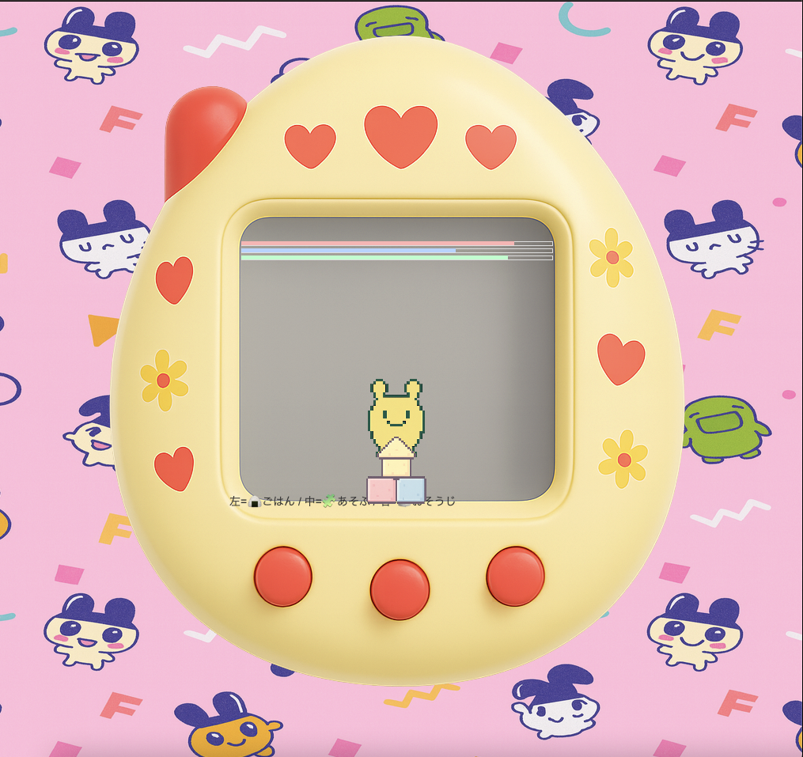

# Tamagotti - Virtual Pet in Python 🐣

Tamagotti is a small virtual pet game inspired by the classic **Tamagotchi**, 
the handheld digital pet created by Bandai in the 1990s.  
This project re-imagines the concept using **Python** and **Tkinter**.

If you've never heard of a Tamagotchi:  
It was a keychain-sized device with a tiny screen where you had to take care of a digital creature.  
You had to feed it, play with it, and clean up after it — otherwise it would get unhappy or even "die."  
This project is a playful homage to that idea.


---

## Features ✨
- **Feed your pet** with rice balls 🍙
- **Play with blocks** 🧩 to keep it happy
- **Clean up poop** 🧻 to maintain hygiene
- Animated simple pixel-art style
- Runs completely offline on desktop (Tkinter)

---

## Controls 🎮
The pet lives inside a yellow egg-shaped "device."  
There are 3 buttons at the bottom:

- **Left button** → 🍙 Feed your pet  
- **Middle button** → 🧩 Play with blocks  
- **Right button** → 🧻 Clean the poop  

---

## Installation ⚙️

Clone this repository:

```bash
git clone https://github.com/USERNAME/tamagotti.git
cd tamagotti
